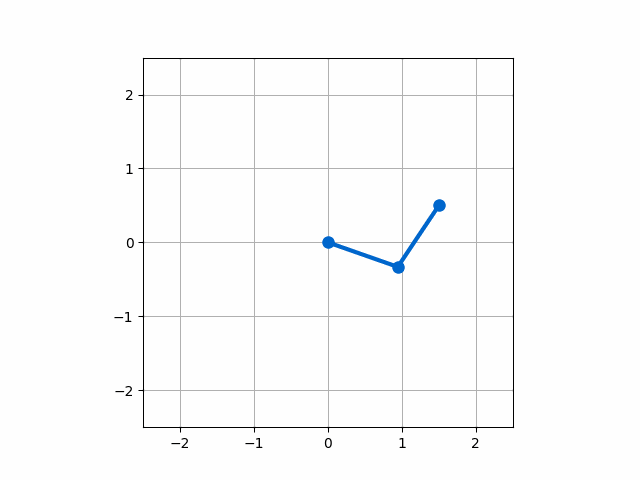

# 2-Link Robotic Arm Kinematics and Trajectory Planning

This project is a Python-based simulation of a 2-degree-of-freedom (2-DOF) planar robotic arm. It demonstrates the core principles of robotic motion by solving both forward and inverse kinematics, and plans a smooth trajectory between two points in space.

<div align="center">
  
  <br />
  <em>Fig 1. Animation showing the arm moving from a start to an end position along a planned linear trajectory.</em>
</div>

## Key Concepts Implemented

1.  **Forward Kinematics:** Given a set of joint angles (`θ1`, `θ2`), this model calculates the `(x, y)` position of the arm's end-effector using fundamental trigonometric relationships.

2.  **Inverse Kinematics:** Given a desired position `(x, y)` for the end-effector, this model calculates the necessary joint angles. This was solved analytically using the Law of Cosines, accounting for both "elbow up" and "elbow down" configurations to find all possible solutions.

3.  **Trajectory Planning:** To ensure smooth and predictable motion, a linear path was interpolated in Cartesian space between a start and end point. The inverse kinematics model was then used to solve for the required joint angles at each step along this path.

4.  **Animation & Visualization:** The final motion was visualized using `Matplotlib`'s animation functionality to provide a clear, dynamic depiction of the arm's movement and validate the kinematic models.

## Technologies Used
* Python
* NumPy (for numerical operations and vectorization)
* Matplotlib (for plotting and animation)
* Jupyter Notebook

## Setup and Installation

To run this simulation on your local machine, follow these steps:

1.  **Clone the repository:**
    ```bash
    git clone [https://github.com/YourUsername/robotic-arm-kinematics.git](https://github.com/YourUsername/robotic-arm-kinematics.git)
    cd robotic-arm-kinematics
    ```

2.  **Create and activate a Conda environment:**
    ```bash
    # It is recommended to create a new environment for this project
    conda create --name robotics-env python=3.9
    conda activate robotics-env
    ```

3.  **Install the required dependencies:**
    ```bash
    pip install -r requirements.txt
    ```

## How to Run
1.  Ensure your Conda environment (`robotics-env`) is active.
2.  Launch Jupyter Notebook: `jupyter notebook`
3.  In the Jupyter interface, open the `robotic_arm_simulation.ipynb` file.
4.  Run the cells sequentially from top to bottom to see the simulation and generate the animation.
